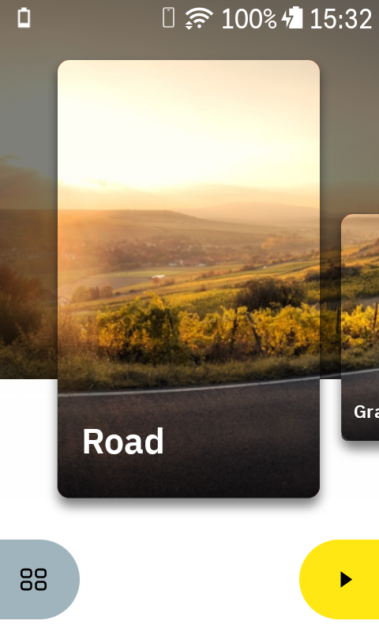
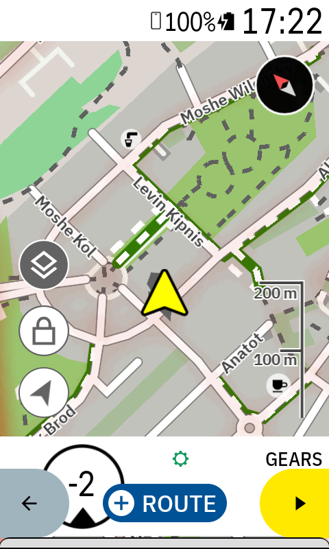
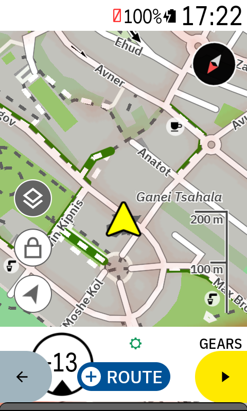
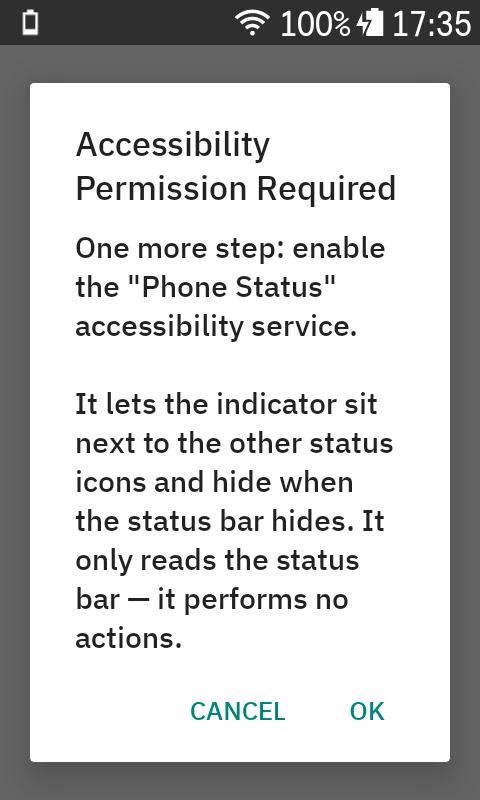
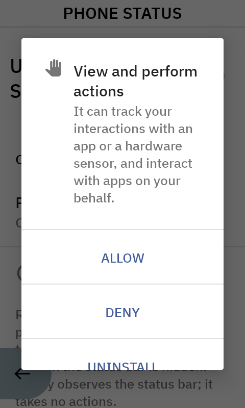
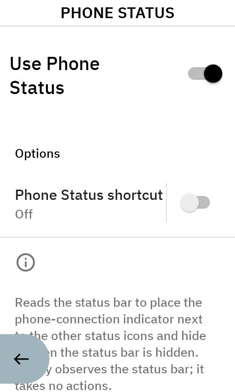

# karoo-phonestatus

A small [Hammerhead Karoo](https://www.hammerhead.io/) extension that displays the **phone connection status** as a native-looking indicator in the status bar.

Built on [`karoo-ext`](https://github.com/hammerheadnav/karoo-ext). Compatible with Karoo 2 (Android 8) and Karoo 3 (Android 12).

### Visuals
|               Dashboard (Connected)               |            Ride (Connected)             |                    Disconnected                    |
|:-------------------------------------------------:|:---------------------------------------:|:--------------------------------------------------:|
|  |  |  |

## Features
- **Adaptive Appearance**: The icon is white on the dark system launcher and black on the light ride screens, matching native icons perfectly.
- **Connection Awareness**: Turns **amber** if the phone connection is lost, so you never miss a notification or sync issue.
- **Smart Positioning**: Automatically slides to follow other status icons (like Wifi or Battery) as they appear or disappear.
- **Zero Configuration**: Once permissions are granted, it runs automatically on every boot.

## How to install

### Method 1: Hammerhead Companion App (Recommended)
This is the easiest way to install the extension on **Karoo 3**.
1. Open this repository on your smartphone's browser.
2. Go to the [Releases](https://github.com/alifib/karoo-phonestatus/releases) page.
3. Long-press the download link for `karoo-phonestatus.apk`.
4. Select **Share** and choose the **Hammerhead Companion** app.
5. The companion app will transfer the file and prompt you to install it on your Karoo.

For more details, see the [Hammerhead Sideloading Guide](https://support.hammerhead.io/hc/en-us/articles/31576497036827-Companion-App-Sideloading).

### Method 2: ADB Sideload (Karoo 2)
1. Enable developer options and USB debugging on your Karoo.
2. Connect to a PC and run: `adb install karoo-phonestatus.apk`.

## Permissions required

The app requires two specific Android permissions to function. **The extension will not work without these permissions.**

| Permission | Why it is needed |
| :--- | :--- |
| **Display over other apps** | Allows the phone icon to be drawn on top of the system status bar and ride screens. |
| **Accessibility Service** | Allows the app to detect the position of other status icons so the phone indicator can be placed correctly. |

### How to approve
When you first launch the **Phone Status** app from the Karoo app menu, it will guide you through the process:

1. **Overlay Permission**: A dialog will appear; tap **OK** to open the system settings and enable "Allow display over other apps".
2. **Accessibility Permission**: A second dialog will appear; tap **OK** to open the Accessibility settings. Find **Phone Status** in the "Downloaded apps" section and toggle it **On**.

> [!NOTE]
> **Privacy Note**: While Android shows a standard warning about "Full control", this service is strictly **read-only**. It only monitors the system status bar and the Karoo ride app to calculate the icon position. It does not collect or transmit any data.

## How it works

Two parts, and both need a workaround because Karoo OS has no direct API:

**The indicator** — the Karoo status/clock bar is owned by Karoo OS and has no injection API, so this extension draws an Android `WindowManager` overlay (`TYPE_APPLICATION_OVERLAY`) at the top of the screen.

**The signal** — getting the phone state is reverse-engineered from the system service **`io.hammerhead.phoneservice`**. This is the same source of truth used by the system UI itself.

## Positions and Tuning
The indicator mirrors the real status bar:
- It sits pinned just left of the left-most icon in the status bar's right cluster.
- It hides whenever the status bar itself is hidden.
- It adapts its tint (White/Black) based on the current screen's background.

## References
- [karoo-ext](https://github.com/hammerheadnav/karoo-ext) — the SDK
- [karoo-powerbar](https://github.com/timklge/karoo-powerbar) — inspiration for overlay patterns
- [awesome-karoo](https://github.com/timklge/awesome-karoo) — community extensions

## License
Apache 2.0. See [LICENSE](LICENSE).
